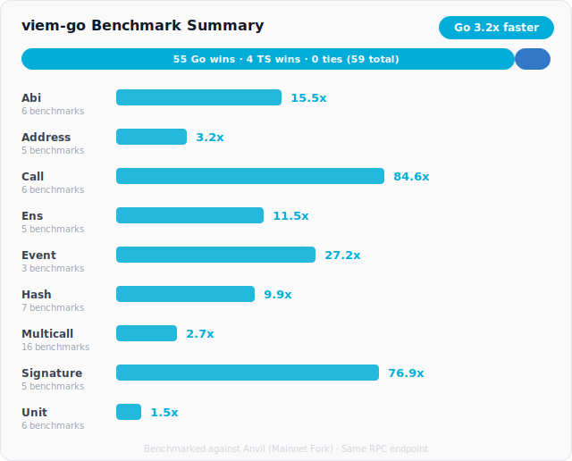
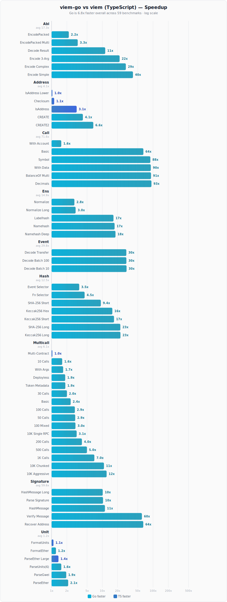

# viem-go

Go Interface for Ethereum -- inspired by [viem](https://viem.sh)

[](https://github.com/ChefBingbong/viem-go/actions/workflows/ci.yml)
[](https://pkg.go.dev/github.com/ChefBingbong/viem-go)

> **Note:** This project is under active development. APIs may change.e This project is under active development and APIs may change

## Why viem go

If you have used viem in TypeScript you already know the API. viem go brings a similar developer experience to Go with compiled performance and concurrency. It improves the workflow compared to go ethereum by providing a higher level interface and utilities such as ABI encoding helpers, multicall support, and unit parsing.

## Install

```bash
go get github.com/ChefBingbong/viem-go
```

## Development

```bash
go mod download
make test
make lint
cd benchmarks && make bench
```

## API similarity

The APIs are designed to look and feel the same so viem code is easy to translate to viem go.

### Create a client

TypeScript

```ts
import { createPublicClient, http } from "viem"
import { mainnet } from "viem/chains"

const client = createPublicClient({ chain: mainnet, transport: http() })
const blockNumber = await client.getBlockNumber()
```

Go

```go
c, _ := client.NewClient("https://eth.llamarpc.com")
defer c.Close()

blockNumber, _ := c.GetBlockNumber(context.Background())
```

### Read a contract

TypeScript

```ts
const balance = await client.readContract({
  address: "0xA0b86991c6218b36c1d19D4a2e9Eb0cE3606eB48",
  abi: parseAbi(["function balanceOf(address) view returns (uint256)"]),
  functionName: "balanceOf",
  args: ["0xd8dA6BF26964aF9D7eEd9e03E53415D37aA96045"],
})
```

Go

```go
usdc := erc20.MustNew(common.HexToAddress("0xA0b86991c6218b36c1d19D4a2e9Eb0cE3606eB48"), c)
balance, _ := usdc.BalanceOf(ctx, common.HexToAddress("0xd8dA6BF26964aF9D7eEd9e03E53415D37aA96045"))
```

### Parse units

TypeScript

```ts
import { parseEther, formatEther, parseGwei } from "viem"

const wei = parseEther("1.5")
const eth = formatEther(wei)
const gasPrice = parseGwei("20.5")
```

Go

```go
import "github.com/ChefBingbong/viem-go/utils/unit"

wei, _ := unit.ParseEther("1.5")
eth := unit.FormatEther(wei)
gasPrice, _ := unit.ParseGwei("20.5")
```

### Hashing and signatures

TypeScript

```ts
import { keccak256, hashMessage, verifyMessage } from "viem"

const hash = keccak256("0x68656c6c6f")
const msgHash = hashMessage("hello world")
const valid = await verifyMessage({ address, message: "hello", signature: sig })
```

Go

```go
import (
  "github.com/ChefBingbong/viem-go/utils/hash"
  "github.com/ChefBingbong/viem-go/utils/signature"
)

h := hash.Keccak256([]byte("hello"))
msgHash := signature.HashMessage(signature.NewSignableMessage("hello world"))
valid, _ := signature.VerifyMessage(address, signature.NewSignableMessage("hello"), sig)
```

## Typed contracts

viem go supports typed contract templates using generics and an optional code generator.

Typed function descriptors

```go
var (
  Name      = contract.Fn[string]{Name: "name"}
  BalanceOf = contract.Fn1[common.Address, *big.Int]{Name: "balanceOf"}
)

token, _ := contract.Bind(tokenAddr, abiJSON, client)
name, _ := contract.Call(token, ctx, Name)
balance, _ := contract.Call1(token, ctx, BalanceOf, ownerAddr)
```

Code generator

```bash
go run ./cmd/viemgen init
cp MyToken.json _contracts_typed/json/mytoken.json
go run ./cmd/viemgen --pkg mytoken
```

Built in ERC standards are included such as erc20.

## Performance

Benchmarks show viem go is faster across ABI encoding and decoding, hashing, signature operations, event log decoding, ENS utilities, call actions, multicall batching, and unit parsing. See benchmarks folder for methodology and results charts. viem-go doesn't just match viem's API -- it outperforms it. Across 59 benchmarks spanning 9 test suites, Go wins 54 of them (92%) and wins all 9 suites.



### Speedup by Benchmark



### Latency Comparison


**Key takeaways:**

- **ABI encoding/decoding:** Go is **10-38x faster**. `encodeFunctionData` runs in ~200ns in Go vs ~8us in TypeScript.
- **Hashing (keccak256, sha256):** Go is **9-20x faster**. Native `crypto/sha3` and `crypto/sha256` dominate.
- **Signature recovery/verification:** Go is **63-87x faster**. `recoverMessageAddress` completes in ~27us vs ~2.3ms.
- **Event log decoding:** Go is **27x faster**. Decoding 100 Transfer events: ~37us vs ~998us.
- **ENS (namehash, normalize):** Go is **3-14x faster**. Recursive keccak hashing and Unicode normalization.
- **Call actions:** Go is **88-99x faster** for `eth_call`. ~0.19ms vs ~18ms per call.
- **Multicall batching:** Go is **1.5-5.9x faster**, widening as batch size grows via goroutine fan-out.
- **Unit parsing:** Go is **1.5-2.8x faster** for common operations like `parseEther("1.5")` and `parseGwei("20.5")`.

> 59 benchmarks across 9 suites on Apple M4 Pro against a shared Anvil instance (mainnet fork). Go wins all 9 suites. See [`benchmarks/`](benchmarks/) for full methodology.

### Real-World Comparison: UniswapV2 Pool Extractor

To see how these library-level benchmarks translate into a real application, check out [**viem-go-extractor-demo**](https://github.com/ChefBingbong/viem-go-extractor-demo) -- identical UniswapV2 pool extractors built in both Go (viem-go) and TypeScript (viem + Bun).

Both extractors do the same work: sync 60,000+ pool pairs from on-chain UniswapV2 factories via multicall, decode Sync events from block logs, resolve ERC-20 token metadata, and serve the pool state over an HTTP API. The results show where each language shines:

| Dimension | Winner | Key Finding |
|---|---|---|
| **Multicall (200 contracts)** | Go | **3.5x faster** -- Go's encoding scales linearly while TS shows quadratic-ish overhead |
| **Event decoding** | Go | **9-11x faster** -- compiled byte slicing vs full ABI schema resolution |
| **Factory sync (end-to-end)** | Go | **1.2-2.2x faster** -- compounds across 60K+ pools |
| **JSON serialization** | TypeScript | **1.7-2.3x faster** -- Bun's Zig-optimized `JSON.stringify` |
| **HTTP API under load** | TypeScript | **5-7x lower latency** -- Bun's async I/O model handles 200 concurrent users efficiently |

**The takeaway:** Go (viem-go) is the better choice for the **data pipeline** -- fetching, decoding, and processing on-chain data. TypeScript (viem) is the better choice for the **API layer** -- serving that data to clients. In a production architecture, the optimal design is a Go-based indexer feeding data into a TypeScript API server.

## Typed Contract Templates

One of viem-go's unique features is its **typed contract template system** -- something that has no equivalent in either viem (TypeScript) or go-ethereum.

In TypeScript, viem infers types dynamically from ABI string literals at compile time. Go can't do that. So you're normally stuck with either go-ethereum's `abigen` (thousands of lines of generated boilerplate) or raw `[]any` returns where you cast everything manually.

viem-go solves this with two complementary approaches:

### 1. Typed Function Descriptors (Zero Codegen)

Define your contract methods as typed descriptors using Go generics. The compiler enforces both argument types and return types at build time:

```go
import "github.com/ChefBingbong/viem-go/contract"

// Define once -- these are just type descriptors, no codegen needed
var (
    Name      = contract.Fn[string]{Name: "name"}
    BalanceOf = contract.Fn1[common.Address, *big.Int]{Name: "balanceOf"}
    Allowance = contract.Fn2[common.Address, common.Address, *big.Int]{Name: "allowance"}
)

// Bind a contract
token, _ := contract.Bind(tokenAddr, abiJSON, client)

// Fully type-safe calls -- wrong types won't compile
name, err := contract.Call(token, ctx, Name)
balance, err := contract.Call1(token, ctx, BalanceOf, ownerAddr)
allowance, err := contract.Call2(token, ctx, Allowance, owner, spender)
```

`Fn`, `Fn1`, `Fn2`, `Fn3`, and `Fn4` encode the argument count and types into the Go type system. `Call1` expects exactly one argument of the type specified in `Fn1` -- pass the wrong type and it's a compile error, not a runtime panic.

### 2. `viemgen` Code Generator

For larger projects, the `viemgen` CLI generates complete typed bindings from an ABI JSON file:

```bash
# Initialize the directory structure
go run ./cmd/viemgen init

# Place your ABI JSON file
cp MyToken.json _contracts_typed/json/mytoken.json

# Generate typed Go bindings
go run ./cmd/viemgen --pkg mytoken
```

This produces a Go package with:
- Typed method descriptors (`Methods.Name`, `Methods.BalanceOf`, etc.)
- A contract binding struct with methods for every ABI function
- Pre-parsed ABI caching (parsed once, reused across calls)
- Write method helpers with gas estimation
- Event types and parsing

The generated code uses the same `Fn`/`Call` pattern under the hood, so it composes naturally with multicall and other viem-go features.

### Built-in ERC Standards

Common token standards ship out of the box:

```go
import "github.com/ChefBingbong/viem-go/contracts/erc20"

// Classic binding API
token := erc20.MustNew(usdcAddr, client)
name, _ := token.Name(ctx)
balance, _ := token.BalanceOf(ctx, owner)

// Or use typed descriptors directly
token2 := contract.MustBind(usdcAddr, []byte(erc20.ContractABI), client)
name, _ := contract.Call(token2, ctx, erc20.Methods.Name)
balance, _ := contract.Call1(token2, ctx, erc20.Methods.BalanceOf, owner)
```

## Implementation Status

Early -- core client, public actions (`call`, `multicall`, `getBlockNumber`, `getBalance`, etc.), contract bindings, ABI encoding/decoding, unit parsing, hashing, and signature utilities are implemented.

## Development

```bash
# Install dependencies
go mod download

# Run tests
make test

# Run linter
make lint

# Run benchmarks (requires Foundry for Anvil)
cd benchmarks && make bench
```

## Contributing

Contributions are welcome! Please feel free to submit a Pull Request.

## Acknowledgments

- [viem](https://github.com/wevm/viem) -- The original TypeScript library this project is inspired by
- [go-ethereum](https://github.com/ethereum/go-ethereum) -- Ethereum Go implementation used for cryptographic primitives
