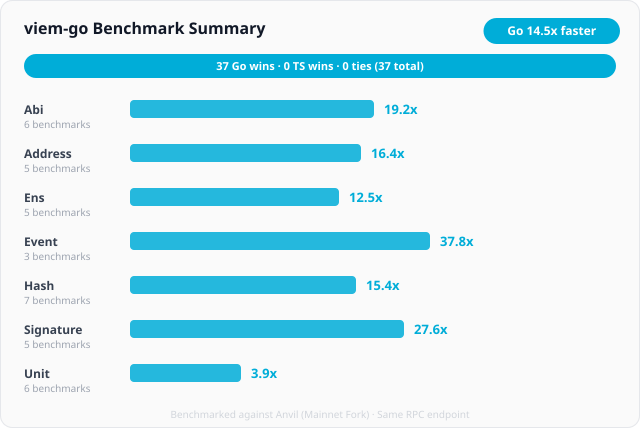

# viem-go

Go Interface for Ethereum -- inspired by [viem](https://viem.sh)

[](https://github.com/ChefBingbong/viem-go/actions/workflows/ci.yml)
[](https://pkg.go.dev/github.com/ChefBingbong/viem-go)

> **Note:** This project is under active development. APIs may change.e This project is under active development and APIs may change

## Why viem go

If you have used viem in TypeScript you will be familiar with viem-go. Viem go brings a similar developer experience to Go with the extra benefits of compiled performance and concurrency. It improves the workflow compared to go ethereum by providing a higher level interface and utilities such as ABI encoding helpers, multicall support, and unit parsing, all whist not sacrificing any preofrmance relative to go-ethereum

## Install

```bash
go get github.com/ChefBingbong/viem-go
```

## Development

```bash
go mod download
make test
make lint
cd benchmarks && make bench
```

## API similarity

The APIs are designed to look and feel the same so viem code is easy to translate to viem go.

### Create a client

TypeScript

```ts
import { createPublicClient, http } from "viem"
import { mainnet } from "viem/chains"

const client = createPublicClient({ chain: mainnet, transport: http() })
const blockNumber = await client.getBlockNumber()
```

Go

```go
c, _ := client.NewClient("https://eth.llamarpc.com")
defer c.Close()

blockNumber, _ := c.GetBlockNumber(context.Background())
```

### Read a contract

TypeScript

```ts
const balance = await client.readContract({
  address: "0xA0b86991c6218b36c1d19D4a2e9Eb0cE3606eB48",
  abi: parseAbi(["function balanceOf(address) view returns (uint256)"]),
  functionName: "balanceOf",
  args: ["0xd8dA6BF26964aF9D7eEd9e03E53415D37aA96045"],
})
```

Go

```go
usdc := erc20.MustNew(common.HexToAddress("0xA0b86991c6218b36c1d19D4a2e9Eb0cE3606eB48"), c)
balance, _ := usdc.BalanceOf(ctx, common.HexToAddress("0xd8dA6BF26964aF9D7eEd9e03E53415D37aA96045"))
```

### Parse units

TypeScript

```ts
import { parseEther, formatEther, parseGwei } from "viem"

const wei = parseEther("1.5")
const eth = formatEther(wei)
const gasPrice = parseGwei("20.5")
```

Go

```go
import "github.com/ChefBingbong/viem-go/utils/unit"

wei, _ := unit.ParseEther("1.5")
eth := unit.FormatEther(wei)
gasPrice, _ := unit.ParseGwei("20.5")
```

### Hashing and signatures

TypeScript

```ts
import { keccak256, hashMessage, verifyMessage } from "viem"

const hash = keccak256("0x68656c6c6f")
const msgHash = hashMessage("hello world")
const valid = await verifyMessage({ address, message: "hello", signature: sig })
```

Go

```go
import (
  "github.com/ChefBingbong/viem-go/utils/hash"
  "github.com/ChefBingbong/viem-go/utils/signature"
)

h := hash.Keccak256([]byte("hello"))
msgHash := signature.HashMessage(signature.NewSignableMessage("hello world"))
valid, _ := signature.VerifyMessage(address, signature.NewSignableMessage("hello"), sig)
```

## Typed contracts

viem go supports typed contract templates using generics and an optional code generator.

Typed function descriptors

```go
var (
  Name      = contract.Fn[string]{Name: "name"}
  BalanceOf = contract.Fn1[common.Address, *big.Int]{Name: "balanceOf"}
)

token, _ := contract.Bind(tokenAddr, abiJSON, client)
name, _ := contract.Call(token, ctx, Name)
balance, _ := contract.Call1(token, ctx, BalanceOf, ownerAddr)
```

Code generator

```bash
go run ./cmd/viemgen init
cp MyToken.json _contracts_typed/json/mytoken.json
go run ./cmd/viemgen --pkg mytoken
```

Built in ERC standards are included such as erc20.

## Performance

Viem-go absolutley crushes viem across every benchmark we ran. Their is on avaerage 20x improvements across ABI encoding and decoding, hashing, signature operations, event log decoding, ENS utilities, call actions, multicall batching, and unit parsing. See benchmarks folder for methodology and results charts. At 5000 iterations, Go wins **37/37 benchmarks (100%)** with a **14.55x geometric mean speedup**. At 50 iterations the speedup peaks at **29.89x**.

### Summary (5000 iterations)




## Implementation Status

Early. Whilest most features have been build out, much work still needs to be done in order to relaise the maxoum amount of optimisation in relation to viem anf go-ethereum

## Development

```bash
# Install dependencies
go mod download

# Run tests
make test

# Run linter
make lint

# Run benchmarks (requires Foundry for Anvil)
cd benchmarks && make bench
```

## Contributing

Contributions are welcome! Please feel free to submit a Pull Request.

## Acknowledgments

- [viem](https://github.com/wevm/viem) -- The original TypeScript library this project is inspired by
- [go-ethereum](https://github.com/ethereum/go-ethereum) -- Ethereum Go implementation used for cryptographic primitives
